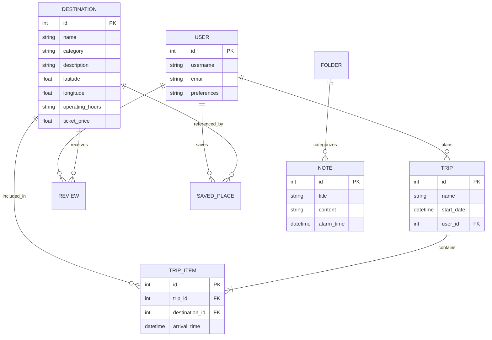

# Desain Sistem (System Design) - Petunjuk Arah V2

**Nama Proyek:** Petunjuk Arah (Smart Travel Assistant)
**Versi Dokumen:** 2.0
**Tanggal:** 29 Desember 2024

---

## 1. Arsitektur Sistem

Sistem menggunakan **Layered Architecture** dengan pemisahan antara API Backend dan UI Web Responsive.

- **Presentation Layer**: Thymeleaf Templates dengan Tailwind CSS untuk UI Web & Mobile Responsive.
- **Service Layer**: Logika pencarian rute, integrasi API cuaca, dan manajemen itinerary.
- **Data Access Layer**: Spring Data JPA untuk interaksi dengan database.

---

## 2. Desain Database (Data Design)

### 2.1 Skema Database (ERD)

---

## 3. Desain API (V2 Endpoints)

| Method | Endpoint | Deskripsi |
| :--- | :--- | :--- |
| GET | `/api/v2/search` | Mencari tempat dengan filter (rating, jarak, harga) |
| GET | `/api/v2/route` | Mendapatkan instruksi rute berdasarkan mode (Fastest, Scenic) |
| POST | `/api/v2/trips` | Menambah rencana perjalanan baru |
| GET | `/api/v2/weather` | Mendapatkan info cuaca real-time koordinat tertentu |

---

## 4. UI/UX Flow

1. **Dashboard Utama**: Menampilkan peta besar dengan posisi user dan bar pencarian cepat.
2. **Bottom Navigation**: Akses cepat ke Home, Explore, Navigation, Trip Planner, dan Profile.
3. **Trip Planner UI**: Form interaktif untuk menentukan destinasi dan jadwal perjalanan.
